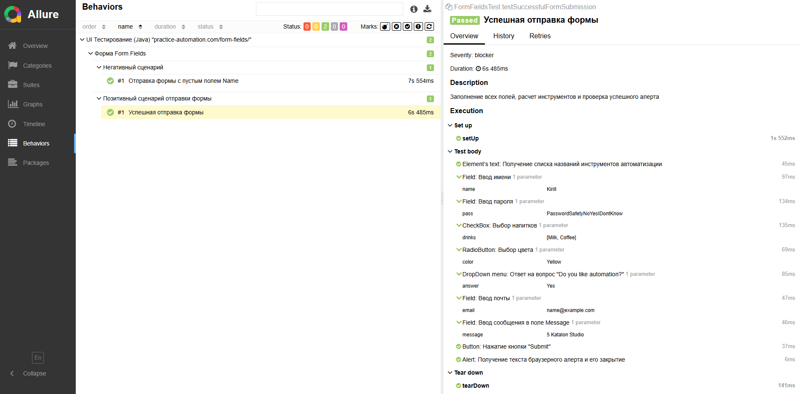
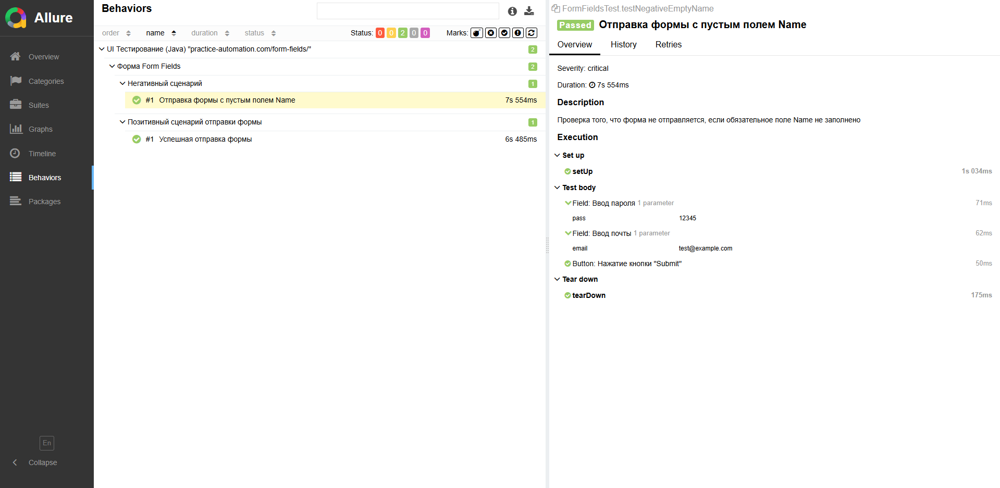

# SDET Practicum (ver. Java)

Проект содержит автоматизированные тесты для страницы Form Fields

## Стек технологий
- **Java**
- **Gradle 8.13**
- **JUnit 5**
- **Selenium**
- **Allure**

## Тестовая документация

### Общие шаги:
Открыть страницу https://practice-automation.com/form-fields/

### Кейс №1: Позитивный (Успешная отправка)
**Шаги:**
1. Заполнить поле **Name**
2. Заполнить поле **Password**
3. Из списка **What is your favorite drink?** выбрать *Milk* и *Coffee*
4. Из списка **What is your favorite color?** выбрать *Yellow*
5. В поле **Do you like automation?** выбрать *Yes*
6. Поле **Email** заполнить строкой формата *name@example.com*
7. В поле **Message** написать количество инструментов, описанных в пункте **Automation tools**,
   и написать инструмент из списка **Automation tools**, содержащий наибольшее количество символов
8. Нажать на кнопку **Submit**

**Ожидаемый результат**:
Появление алерта **"Message received!"**

### Кейс №2: Негативный (Пустое имя)
**Шаги:**
1. Оставить поле **Name** пустым.
2. Заполнить остальные поля валидными данными.
3. Нажать Submit.

**Ожидаемый результат**: Форма не отправляется, алерт не появляется.

## Запуск проекта
1. Запуск тестов:
```bash
./gradlew test
```
2. Генерация отчета Allure:
```bash
./gradlew allureServe
```

## Результат тестирования
**Позитивный тест-кейс:**

**Негативный тест-кейс:**
